# The Scary Movie

## Introduction

The Scary Movie website is a CLI developed with Python language. The interface is straightforward to interact with. The site is about a list of some available horror movies where the user must select which movie he/she will book to watch. 

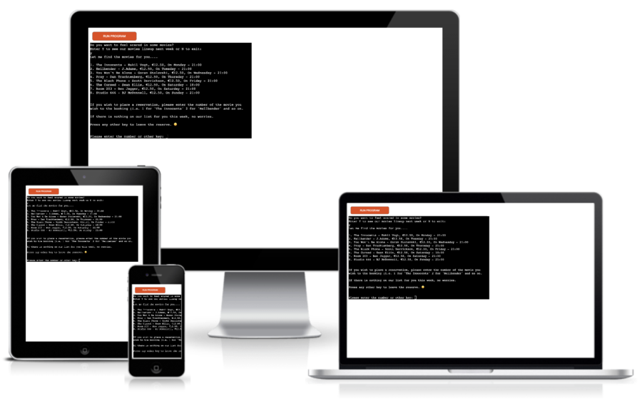

[View the live Website on Github Pages](https://the-scary-movie.herokuapp.com/) Please note: To open any links in this document in a new browser tab, please press CTRL + Click.

## Table Of Contents
* [UX](#ux)

  * [Flowchart](#flowchart)
  * [Colour Pallete](#colour-palette)

* [Features](#features)
  
  * [Common Features](#common-features)
    * [Greeted / Decision](#greeted--decision)
    * [Leave Cinema Reservation](#leave-cinema-reservation)
    * [Invalid Input](#invalid-input)
    * [List of Movies / Decision](#list-of-movies--decision)
    * [Select the movie](#select-the-movie)
    * [User Details](#user-details)
    * [Incorrect Details](#incorrect-details)
    * [Incorrect Name](#incorrect-name)
    * [Incorrect Last Name](#incorrect-last-name)
    * [Incorrect Phone Nmber](#incorrect-phone-number)
    * [Confirmed Details](#confirmed-details)
    * [Select Another Movie](#select-another-movie)
    * [Google Sheet](#google-sheet)

* [Technologies](#technologies)
* [Python Libraries](#python-libraries)
* [Testing](#testing)
* [Deployment](#deployment)
* [Credits](#credits)

## UX

### Flowchart
* Initially, I used Flowchart to organise the structure of the logic. The flowchart shows the steps as boxes of various kinds, and their order by connecting the boxes with arrows. A flowchart is a type of diagram that represents a workflow or process.

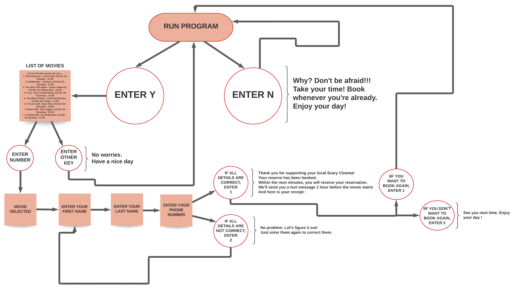

### Colour Palette
* The colours used in this CLI are standard colours from the Heroku website.

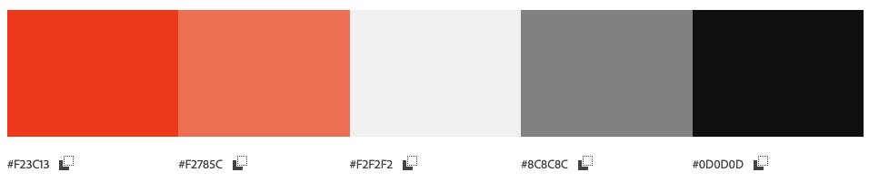

## Features

### Common Features

#### Greeted / Decision 
* The user will greeted with the name of the cinema with a welcome message. The user can choose whether to see our list of movies or change their mind and leave the platform. The option to view the list of movies is to enter Y or N to exit. I made sure to capture also a smaller letter if the user types in lowercase.

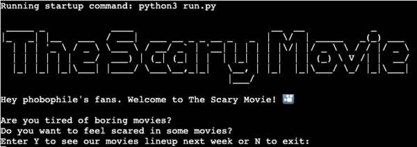

#### Leave Cinema Reservation
* If the user decides not to book the movie, he/she must exit the platform by typing N.

#### Invalid Input
* If the user enters a invalid input an error message shows up and he will be asked to enter either Y or N.

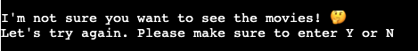

#### List of Movies / Decision
* If the user decides to book the movie, a list of 8 horror films will be printed and displayed. 

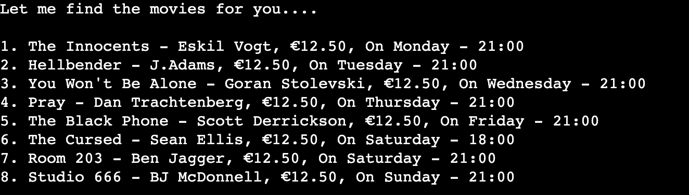

#### Select the movie
* If the user wants to book a movie, he/she is asked to enter a number between 1 and 8 to choose the desired title. Note: The user should read a guide explaining how to select the movie before their choice.

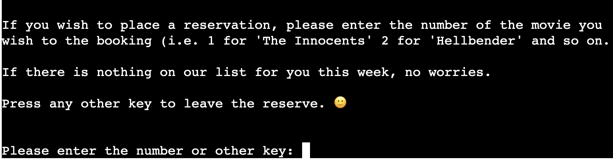

#### User Details
* If the user has decided on the movie, he/she must fill in its details. The following details are name, last name and phone number. 

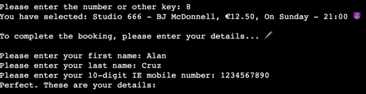

#### Incorrect Details
* If the user fills in the incorrect data, he/she will have to fill it in again. Note: an error message will be displayed. 

#### Incorrect Name
* If the user enters an invalid input he/she will be asked to start again from the top. Note: an error message will be displayed.

#### Incorrect Last Name
* If the user enters an invalid input he/she will be asked to start again from the top. Note: an error message will be displayed.

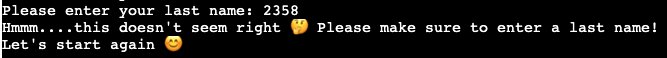

#### Incorrect Phone Number
* If the user enters an invalid input he/she will be asked to make sure to put the right numbers. Note: an error message will be displayed.

#### Confirmed Details
* Once the user has confirmed their details, at this stage, the user is being thanked for supporting their local cinema, and a small receipt will be printed. On this receipt, the user will find the address of the cinema, the title and the price of the movie he has booked and the date and time.

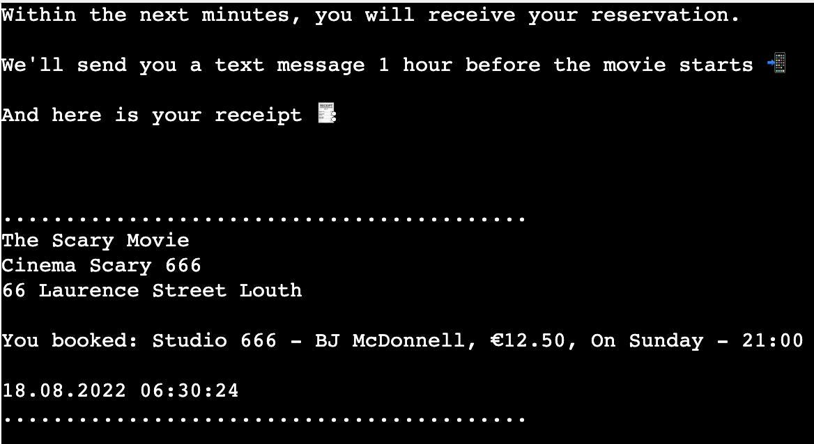

#### Select Another Movie
* If the user wants to book another movie, he must select 1, otherwise select any other key.

* If he/she enters 1 the programme starts again from the beginning.

* If he/she enters any other key, it will display a goodbye message.

#### Google Sheet
* Data reported by users will be stored in a spreadsheet created by Google Sheet.

## Technologies
* Technologies / Tools Used

  * 
  * 

## Future Features

  * To allow the user to enter the email and receive confirmation via email.
  * To allow the user to print the PDF confirmation booking.

## Python Libraries
### Modules
* Gspread - API for Google Sheets. Open a spreadsheet by title, key or url. Read, write, and format cell ranges.
* Datetime - The datetime module supplies classes for manipulating dates and times.
* Pyfiglet - It takes ASCII text and renders it in ASCII art fonts. 
* Sys - This module provides access to some variables used or maintained by the interpreter and to functions that interact strongly with the interpreter.
* Time - Time access and conversions. This module provides various time-related functions.

## Testing
* The programme has been tested on Google Chrome, Firefox and Safari without any issues. Due to the nature of the programme, it is not suitable for mobile phones and smaller devices. 

### Unfixed Bugs
* At the moment, the time printed on the receipt is UTC-time. As it doesn't affect the functionality of the program and is solely for aesthetic purposes (the receipt) I decided to leave it for now.

### Validator Testing
#### PEP8 - Style Guide for Python Code

* No errors were found during the final check.

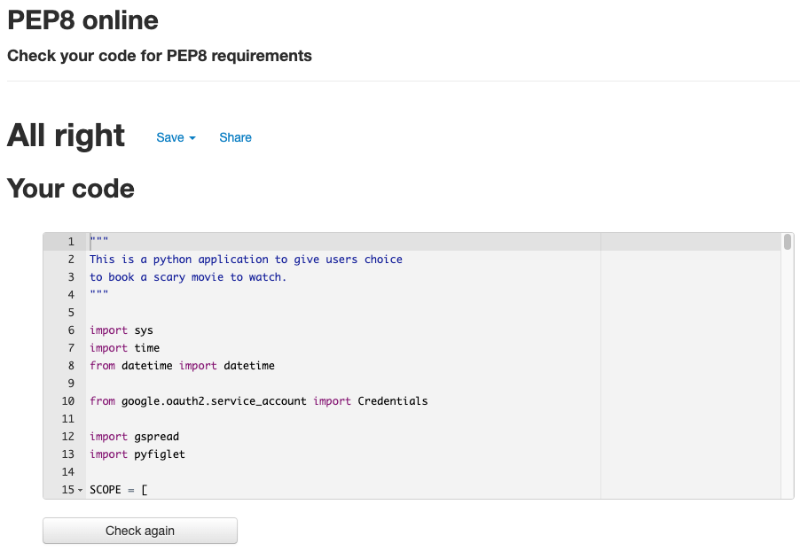

## Deployment
* The site was deployed to Heroku pages. The steps to deploy are as follows:

  * Log in [Heroku](https://id.heroku.com/login).
  * Click 'New' and select 'Create new app'
  * Choose a name for the app, region and click on 'Create app'.
  * Only 'Deploy' and 'Settings' are relevant from the menu section. Starting with the 'Settings' first.
  * Now Buildpacks need to be added. They install future dependencies that are needed outside of the requirements file. The first is Python and the second is node.js. Python needs to be selected first and then node.js. Save this selection.
  * Now the 'Deploy' section needs to be selected from the menu and connect it to github.
  * Enter the name of the repository we want to connect it with and click 'Connect'
  * The choice appears now to either deploy using automatic deploys or manual deployment, which deploys the current state of the branch.
  * Click deploy branch.

* How to run the program. The steps to run the program are as follow:

 * To start the program again, the user must return to the beginning where it says "RUN PROGRAM" and click with the right mouse button or refresh the page.
  
  * To run a backend Python file, type python3 app.py, if your Python file is named app.py of course.

 The live link can be found here - [The Scary Movie](https://the-scary-movie.herokuapp.com/)

## Credits

* [Lucidchart](https://www.lucidchart.com/pages/?gclid=Cj0KCQjwjIKYBhC6ARIsAGEds-JIeGSDMRy_P3fWYclv64V6wjqC_rVbQc5OdblYa18RHEW1qgyD3DsaAi_4EALw_wcB&km_CPC_AdGroupID=131887302701&km_CPC_AdPosition=&km_CPC_CampaignId=16698262314&km_CPC_Country=1007877&km_CPC_Creative=590086340333&km_CPC_Device=c&km_CPC_ExtensionID=&km_CPC_Keyword=flowchart&km_CPC_MatchType=e&km_CPC_Network=g&km_CPC_TargetID=aud-381457345638%3Akwd-10404161&km_CPC_placement=&km_CPC_target=&utm_campaign=_chart_en_us%20tier1_desktop_search_RLSA_exact_&utm_medium=cpc&utm_source=google)
* [Stackoverflow](https://stackoverflow.com/)
* [W3Schools](https://www.w3schools.com/)
* [Full Emoji List](https://unicode.org/emoji/charts/full-emoji-list.html)
* [Emojipedia](https://emojipedia.org/)